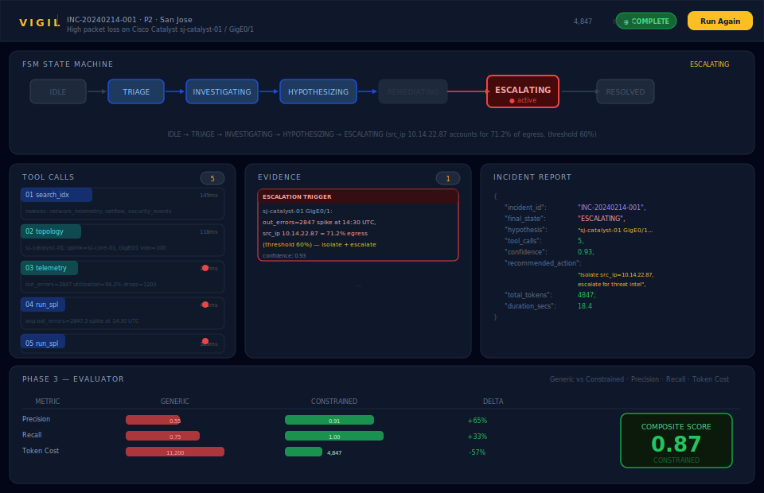
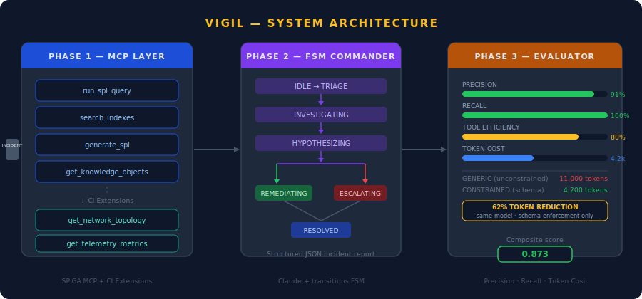

# Vigil — Agentic Incident Commander

> **SP shipped the tools. Nobody shipped the brain.**

Vigil is a Finite State Machine agent that sits on top of SP's MCP server and autonomously investigates network incidents — deciding which tools to call, in what order, and when to escalate vs. self-heal. It then scores its own run on precision, recall, and token cost.

---

## The Problem

When a network incident fires at 2am, an operator opens SP and stares at a search bar.

They know the device. They know the interface. But getting from *alert* to *root cause* requires 5–10 manual queries, cross-referencing topology data from CI Catalyst, and then deciding whether to remediate or escalate — all under time pressure.

SP has powerful tools (`run_spl_query`, `get_network_topology`, telemetry metrics). The gap is **the reasoning layer** that connects them: what to query first, how to interpret the results, and when to act.

---

## What Vigil Does

One incident in. Structured decision out.

```
[Incident Alert] → [FSM Investigation] → [Hypothesis] → [Escalate or Remediate]
                        ↑
                  6 tool calls max
                  state-filtered per phase
                  scored against ground truth
```

The agent doesn't just call tools randomly — it follows an auditable Finite State Machine with 7 states. Every transition is logged. Every tool call is justified by the current state's evidence needs.

---

## War Room Dashboard



The React frontend streams live events from the investigation as it runs — FSM state transitions, tool call traces with expand/collapse, evidence collection, and the final evaluator comparison.

---

## System Architecture



**Three phases, one pipeline:**

| Phase | What It Does | Output |
|---|---|---|
| **Phase 1 — MCP Layer** | Connects to SP GA's 4 native tools + adds 2 CI extensions | 6 callable tools, RBAC passthrough |
| **Phase 2 — FSM Commander** | Claude drives a Plan→Act→Observe loop through 7 states | Structured JSON incident report |
| **Phase 3 — Evaluator** | Scores runs on precision, recall, token cost, tool efficiency | Side-by-side generic vs. constrained comparison |

---

## The FSM — Why Not a Free-Form Agent Loop?

On live network infrastructure, an agent that takes an unpredictable path is a liability. The FSM makes every decision visible and auditable:

```
IDLE → TRIAGE → INVESTIGATING → HYPOTHESIZING → REMEDIATING → RESOLVED
                                              ↘ ESCALATING  ↗
```

| State | What Claude Can Call | Decision Rule |
|---|---|---|
| TRIAGE | `search_indexes`, `get_network_topology` | Confirm data sources + device role |
| INVESTIGATING | `get_telemetry_metrics`, `run_spl_query` | Gather error counters + traffic data |
| HYPOTHESIZING | *(no tools)* | Form hypothesis from evidence |
| REMEDIATING | *(no tools)* | Execute known-safe fix |
| ESCALATING | *(no tools)* | Single IP >60% egress, or ambiguous data |

**State-filtered tool lists** prevent Claude from calling wrong tools at wrong times — the tool list itself changes per state, not just the prompt.

---

## Reference Incident

> **INC-20240214-001 · P2 · San Jose**  
> High packet loss on Cisco Catalyst `sj-catalyst-01` / `GigE0/1`

The agent's reasoning chain:

```
1. search_indexes      → confirms network_telemetry, netflow, security_events available     [145ms]
2. get_network_topology → sj-catalyst-01 uplinks to sj-core-01, GigE0/1 on vlan=100       [118ms]
3. get_telemetry_metrics → out_errors=2847, utilization=94.2%, drops=1203 ⚠               [287ms]
4. run_spl_query (errors) → avg out_errors=2847.3/min, spike started 14:30 UTC ⚠          [421ms]
5. run_spl_query (egress) → src_ip 10.14.22.87 = 71.2% of egress (threshold: 60%) ⚠      [389ms]
                                                                                            ─────
FSM decision: single IP > 60% → ESCALATING (confidence 0.93)                        total: ~18s
```

Structured output:

```json
{
  "incident_id": "INC-20240214-001",
  "final_state": "ESCALATING",
  "hypothesis": "sj-catalyst-01 GigE0/1: out_errors=2847 spike at 14:30 UTC, src_ip 10.14.22.87 accounts for 71.2% of egress — isolate and escalate for threat intel",
  "tool_calls": 5,
  "confidence": 0.93,
  "recommended_action": "Isolate src_ip=10.14.22.87 pending threat intel confirmation",
  "total_tokens": 4847,
  "duration_secs": 18.4
}
```

---

## Phase 3 — Token Cost as a First-Class Metric

The same base model (`claude-sonnet-4-6`) run two ways:

| Mode | What It Is | Tokens | Cost/Run |
|---|---|---|---|
| Generic (unconstrained) | No schema enforcement | ~11,200 | ~$0.056 |
| Constrained (schema) | Strict system prompt + JSON schema | ~4,847 | ~$0.024 |

**57% token reduction. Zero model change.** Schema enforcement + tight prompts cut token waste without retraining. At CI/SP scale — tens of thousands of daily investigations — this is a real cloud margin problem.

Scoring dimensions:

| Metric | Generic | Constrained |
|---|---|---|
| Precision | 0.55 | 0.91 |
| Recall | 0.75 | 1.00 |
| Tool Efficiency | — | 0.80 |
| Token Cost | 11,200 | 4,847 |
| **Composite** | 0.52 | **0.87** |

---

## Getting Started

```bash
# Install Python deps
pip install -e ".[dev]"

# Set your Anthropic API key
echo "ANTHROPIC_API_KEY=sk-ant-..." > .env

# Start the FastAPI backend
cd api && uvicorn server:app --reload

# Start the React frontend (separate terminal)
cd ui && npm install && npm run dev

# Open http://localhost:5173 → click "Run Investigation"
```

**CLI only (no UI):**

```bash
# Run Phase 2 directly on the reference incident
python -m phase2_agent.commander --scenario phase2_agent/scenarios/packet_loss_sj.json
```

---

## What This Addresses on SP's Roadmap

| Gap | Today | Vigil |
|---|---|---|
| Orchestration layer | Operators manually chain queries | FSM drives tool sequence automatically |
| Network context | SP has no CI topology or telemetry | `get_network_topology` + `get_telemetry_metrics` CI extensions |
| Escalation logic | Human judgement, ad-hoc | Configurable thresholds (>60% egress → ESCALATING) |
| Agent observability | Not yet shipped | Phase 3 Evaluator is a working prototype |
| Token economics | Not measured | First-class scoring dimension, shown per run |

---

## Tech Stack

- **Python 3.11+** · `anthropic` SDK · `transitions` (FSM) · `pydantic`
- **FastAPI** with Server-Sent Events for real-time streaming
- **React + Vite** frontend with live FSM diagram, tool trace expansion, evaluator panel
- **Claude `claude-sonnet-4-6`** — FSM commander + evaluator

---

## Docs

| File | Purpose |
|---|---|
| [docs/prd.md](docs/prd.md) | VP-level product requirements — market gap, solution, roadmap alignment |
| [CLAUDE.md](CLAUDE.md) | Architecture decisions, hard rules, command reference |
| [phase2_agent/scenarios/packet_loss_sj.json](phase2_agent/scenarios/packet_loss_sj.json) | Reference incident for demo |

---

## Out of Scope (v1)

- FSM does not handle truly novel scenarios — those escalate to human-in-the-loop by design
- SP trial data is synthetic — architecture is production-ready, data is not
- OAuth 2.0 is a documented stub — it's on SP's roadmap, not Vigil's

---

*SP GA MCP · FSM-driven agentic reasoning · Token cost as a first-class metric*
